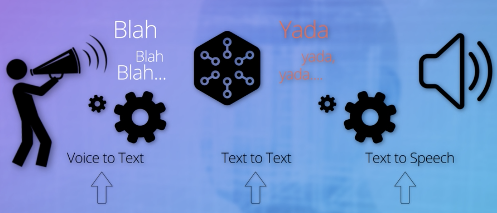
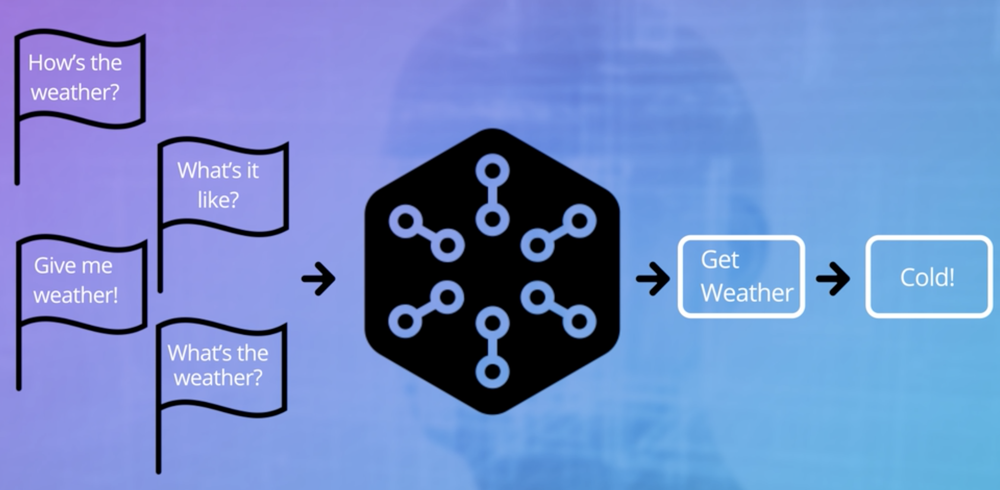
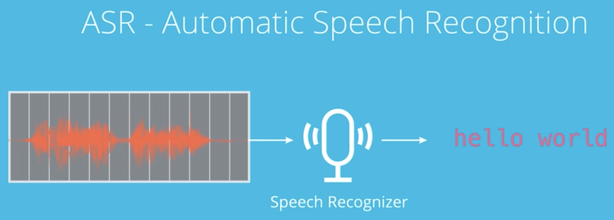
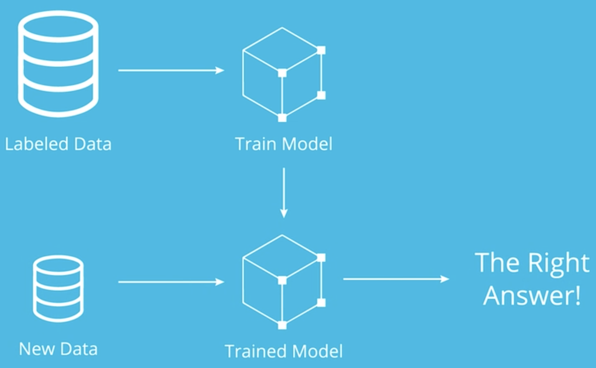
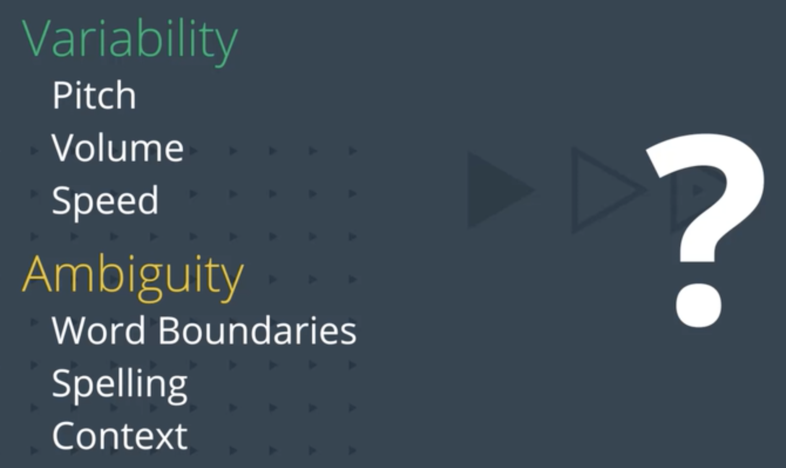

# Welcome to Voice User Interface!

- A VUI is a speech platform that enables humans to communicate with machine by voice.
- VUI used to be the stuff of science fiction.
  - These there parts constitute a general pipeline for building an end to end voice enabled application. Each part employs some aspects of AI.
    1. Audio sound waves from voice must be converted into language texts using machine learning algorithms and probabilistic models.
    2. The resulting text must be reasoned-over using AI logic to determine the meaning and formulate a response.
    3. Finally, the response text must be converted back into understandable speech again with machine learning tools.

---

## VUI Overview

---

- Voice to text: speech recognition,
  1. as person speaks into a microphone, sound vibrations are converted to an audio signal. This signal can be sampled at some rate and converted into vectors of component frequencies, these vectors represent features of sound in a data set. so this step is feature extraction.
  2. next step is to decode or recognize the series of vectors as a word or a sentence. Do that by **probabilistic models** that work well with time series data for the sound pattern which is the **acoustic model**.
  3. decoding a vector with an acoustic model will give us a best guess as to what the words are. but that not enough the could not recognize 'hello world' or 'how a word' not like us! We have **Language** model in our brains trained from years of experience and that sth we need to add to our decoder.
  4. An **accent model** may be needed for the same reason.
  5. if these models are well trained on lots of representative examples, we have a higher probability of producing the correct text

- **Probabilistic Models**:
  1. Build **Hidden Markov Models (HMMs)** to decode a series of gestures.
  2. Use **Recurrent Neural Networks (RNNs)** to train time series data.
- both of these models have been used successfully in speech recognition.
- Once we have speech in form of text, it's time to do the thinking part

---

- Text input reasoned to text output: thinking part of our voice application, the reasoning logic.

---

- Once we have a text response, remaining task is to convert that text to speech. this is the speech synthesis or text to speech (TTS).

---

## VUI Application

- Can be found on cars!
- Dictation application
- Translation application
- Conversational AI technology
  - Apple's Siri
  - Microsoft Cortana
  - Google Home
  - Amazon Alexa on Eco

---

# Speech Recognition

## Intro

- When we say speech recognition, we really talk about **ASR, or automatic speech recognition.**
- ASR goal is to put any continuous audio speech and output the text equivalent.
- The goal is to make the ASR to be speaker independent and have high accuracy.

- ASR can be implemented by gathering a large pool of labelled data, training a model on that data, and then deploying the trained model to accurately label new data.
- The twist is that speech is structured in time and has a lot of variability!

- There are specific challenges we face when decoding spoken words and sentences into text.
- To understand how these challenges can be met, you must take a deeper dive into the **sound signal** itself as well as various **speech models**.
  - The sound signal is our data, you'll get into signal analysis, phonetics,and how to extract features to represent speech data.
  - Models in speech recognition can conceptually be divided into:
    - Acoustic Model: solves the problems of turning sound signals into some kind of phonetic representation.
    - Language Model: houses the domain knowledge of words, grammar, and sentence structure for the language.
  - These conceptual models can be implemented with **probabilistic models** using machine learning algorithms

## Challenges in ASR

##### Why is it so hard?

- The first set of problems to solve is related to the audio signal itself, noise for instance, cars going by, clocks ticking, other people talking, microphone static, our ASR has to know which parts of the audio signal matter and which parts to discard.
- Variability of pitch, Variability of volume. One speaker sounds different than another even when saying the same word. The pitch and loudness don't change the ground truth of which word was spoken. think of these differences as another kind of noise that needs to be filtered out.
- Variability of words speed. Words spoken at different speeds need to be aligned and matched. It's up to the ASR to align the sequences of sound correctly.
- Word boundaries, when we speak words run from one to the next without pause.
- Spoken vs. Written language.
- To summarize:

  - Variability:
    - Pitch
    - Volume
    - Speed
  - Ambiguity
    - Word boundaries
    - Spelling
    - Context

## Signal Analysis
